# Parvagas Current System Workflows

This document describes how the system works right now, based on the current pages, routes, controllers, and services in the repository. Use the notes below each diagram to compare the implementation with the product vision.

## 1. Public Site Navigation

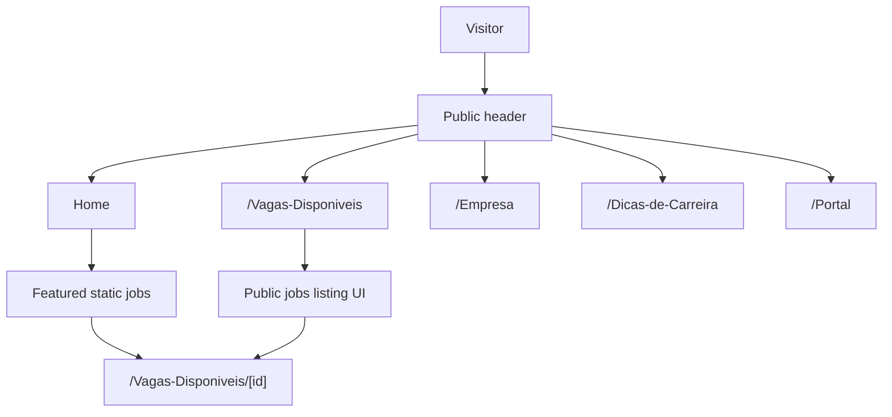
```mermaid
flowchart TD
  visitor["Visitor"] --> header["Public header"]
  header --> home["Home"]
  header --> jobsPage["/Vagas-Disponiveis"]
  header --> companiesPage["/Empresa"]
  header --> tipsPage["/Dicas-de-Carreira"]
  header --> portal["/Portal"]
  home --> featuredJobs["Featured static jobs"]
  featuredJobs --> jobDetail["/Vagas-Disponiveis/[id]"]
  jobsPage --> publicListing["Public jobs listing UI"]
  publicListing --> jobDetail
```

Current state:
- The main public listing page uses a local static jobs array in `src/app/Vagas-Disponiveis/page.tsx`.
- The backend also has public job APIs, but this page is not currently wired to those APIs.

## 2. Public Jobs Listing And Pagination

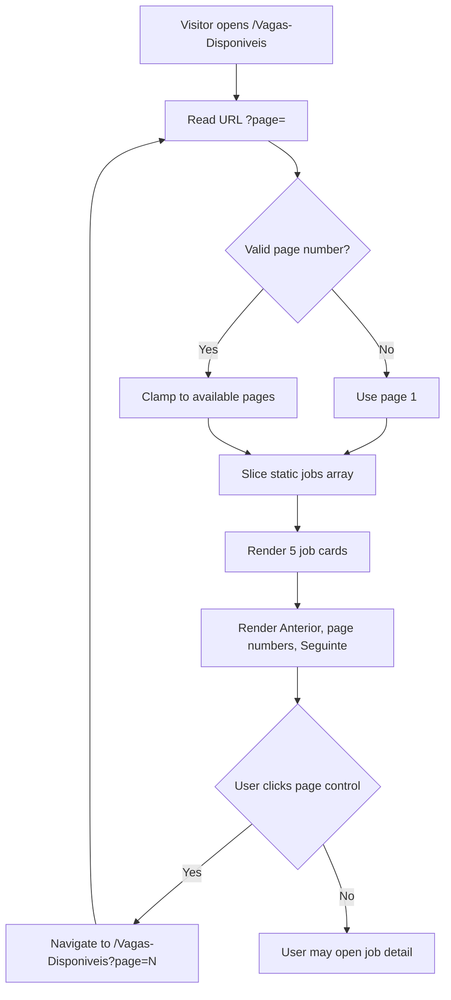
```mermaid
flowchart TD
  visitor["Visitor opens /Vagas-Disponiveis"] --> readQuery["Read URL ?page="]
  readQuery --> validPage{"Valid page number?"}
  validPage -- "No" --> pageOne["Use page 1"]
  validPage -- "Yes" --> clampPage["Clamp to available pages"]
  pageOne --> sliceJobs["Slice static jobs array"]
  clampPage --> sliceJobs
  sliceJobs --> renderCards["Render 5 job cards"]
  renderCards --> renderControls["Render Anterior, page numbers, Seguinte"]
  renderControls --> clickNext{"User clicks page control"}
  clickNext -- "Yes" --> updateUrl["Navigate to /Vagas-Disponiveis?page=N"]
  updateUrl --> readQuery
  clickNext -- "No" --> viewJob["User may open job detail"]
```

Current state:
- Pagination is server-rendered from URL search params.
- Filters are visual controls only right now; they do not filter the listing yet.

## 3. Backend Public Job Search

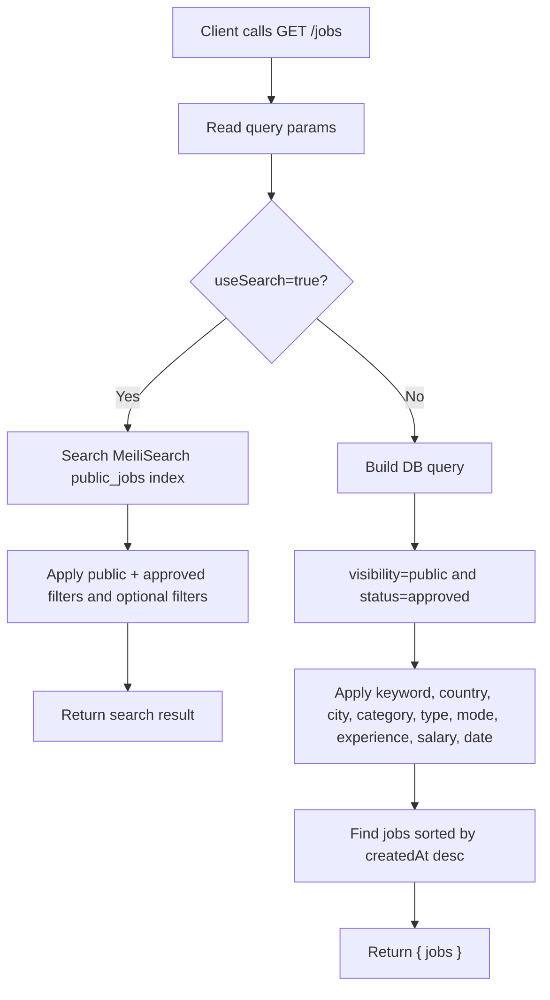
```mermaid
flowchart TD
  client["Client calls GET /jobs"] --> params["Read query params"]
  params --> useSearch{"useSearch=true?"}
  useSearch -- "Yes" --> meili["Search MeiliSearch public_jobs index"]
  meili --> publicFilters["Apply public + approved filters and optional filters"]
  publicFilters --> searchResult["Return search result"]
  useSearch -- "No" --> buildQuery["Build DB query"]
  buildQuery --> publicOnly["visibility=public and status=approved"]
  publicOnly --> optionalFilters["Apply keyword, country, city, category, type, mode, experience, salary, date"]
  optionalFilters --> dbFind["Find jobs sorted by createdAt desc"]
  dbFind --> apiResult["Return { jobs }"]
```

Current state:
- API supports filtering and optional MeiliSearch.
- No API-level pagination is implemented in `server/controller/jobs.js` yet.
- Public API protects private, draft, archived, rejected, and pending jobs from public listing.

## 4. Job Detail

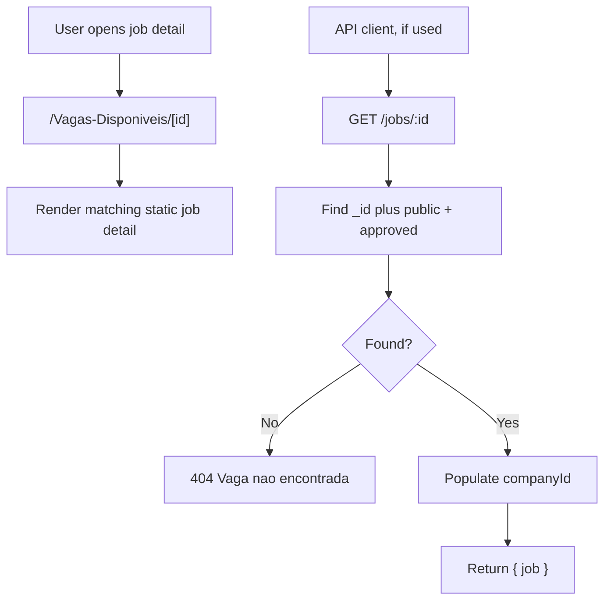
```mermaid
flowchart TD
  user["User opens job detail"] --> frontendDetail["/Vagas-Disponiveis/[id]"]
  frontendDetail --> staticDetail["Render matching static job detail"]
  apiClient["API client, if used"] --> backendDetail["GET /jobs/:id"]
  backendDetail --> findJob["Find _id plus public + approved"]
  findJob --> found{"Found?"}
  found -- "No" --> notFound["404 Vaga nao encontrada"]
  found -- "Yes" --> populateCompany["Populate companyId"]
  populateCompany --> returnJob["Return { job }"]
```

Current state:
- The public frontend detail page appears static/local.
- The backend detail route exists and enforces public approved visibility.

## 5. User Registration And Login

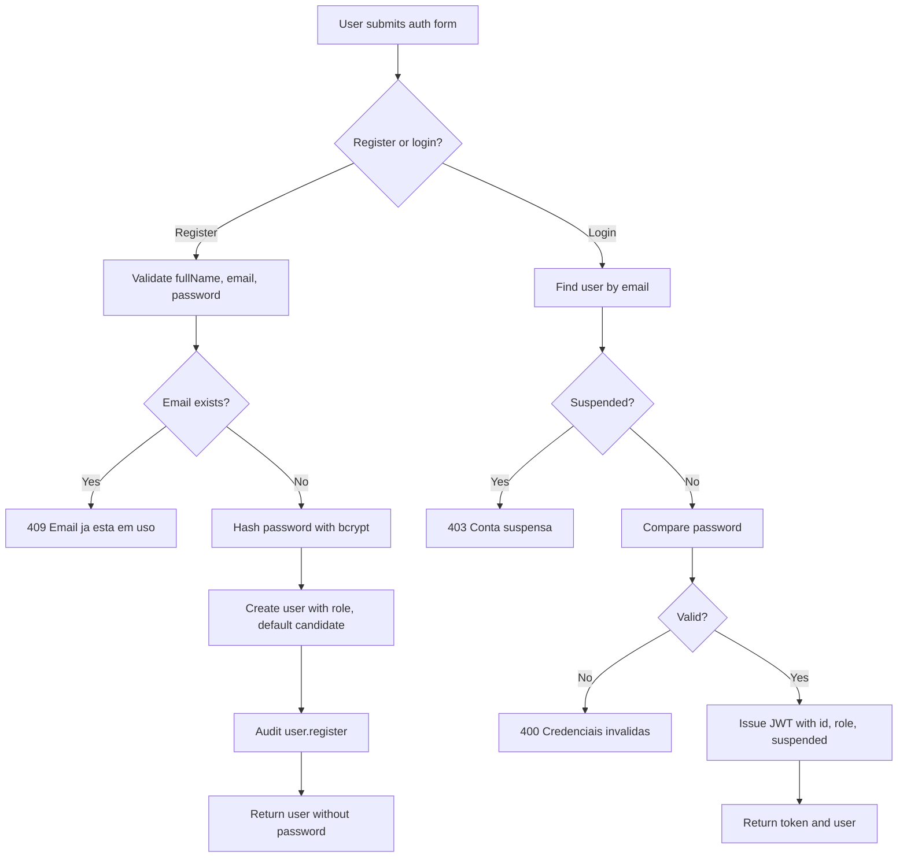
```mermaid
flowchart TD
  user["User submits auth form"] --> choice{"Register or login?"}
  choice -- "Register" --> validateRegister["Validate fullName, email, password"]
  validateRegister --> existingEmail{"Email exists?"}
  existingEmail -- "Yes" --> conflict["409 Email ja esta em uso"]
  existingEmail -- "No" --> hashPassword["Hash password with bcrypt"]
  hashPassword --> createUser["Create user with role, default candidate"]
  createUser --> auditRegister["Audit user.register"]
  auditRegister --> returnUser["Return user without password"]
  choice -- "Login" --> findUser["Find user by email"]
  findUser --> suspended{"Suspended?"}
  suspended -- "Yes" --> blocked["403 Conta suspensa"]
  suspended -- "No" --> comparePassword["Compare password"]
  comparePassword --> validPassword{"Valid?"}
  validPassword -- "No" --> invalid["400 Credenciais invalidas"]
  validPassword -- "Yes" --> issueJwt["Issue JWT with id, role, suspended"]
  issueJwt --> returnToken["Return token and user"]
```

Current state:
- Login uses JWT and role-based middleware elsewhere.
- Registration can accept a role, though default is candidate.

## 6. Candidate CV Upload To Profile Draft

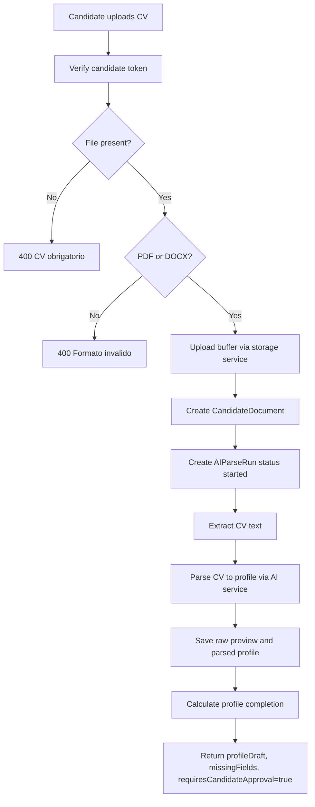
```mermaid
flowchart TD
  candidate["Candidate uploads CV"] --> auth["Verify candidate token"]
  auth --> filePresent{"File present?"}
  filePresent -- "No" --> cvRequired["400 CV obrigatorio"]
  filePresent -- "Yes" --> supported{"PDF or DOCX?"}
  supported -- "No" --> invalidFormat["400 Formato invalido"]
  supported -- "Yes" --> storeFile["Upload buffer via storage service"]
  storeFile --> createDoc["Create CandidateDocument"]
  createDoc --> createRun["Create AIParseRun status started"]
  createRun --> extractText["Extract CV text"]
  extractText --> parseAI["Parse CV to profile via AI service"]
  parseAI --> saveRun["Save raw preview and parsed profile"]
  saveRun --> completion["Calculate profile completion"]
  completion --> returnDraft["Return profileDraft, missingFields, requiresCandidateApproval=true"]
```

Current state:
- AI defaults to fallback heuristics when an external provider is not configured.
- Profile is not persisted as approved in this step.

## 7. Candidate Approves Profile

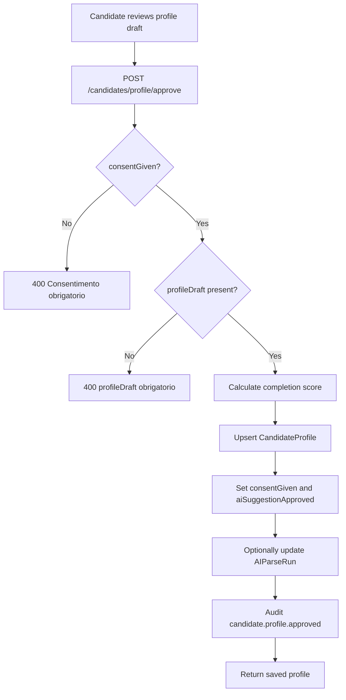
```mermaid
flowchart TD
  candidate["Candidate reviews profile draft"] --> submitApproval["POST /candidates/profile/approve"]
  submitApproval --> consent{"consentGiven?"}
  consent -- "No" --> consentError["400 Consentimento obrigatorio"]
  consent -- "Yes" --> hasDraft{"profileDraft present?"}
  hasDraft -- "No" --> draftError["400 profileDraft obrigatorio"]
  hasDraft -- "Yes" --> completion["Calculate completion score"]
  completion --> upsertProfile["Upsert CandidateProfile"]
  upsertProfile --> markApproved["Set consentGiven and aiSuggestionApproved"]
  markApproved --> updateParseRun["Optionally update AIParseRun"]
  updateParseRun --> audit["Audit candidate.profile.approved"]
  audit --> returnProfile["Return saved profile"]
```

Current state:
- Explicit approval is required before AI-generated profile data becomes the candidate profile.

## 8. Candidate Recommended Jobs

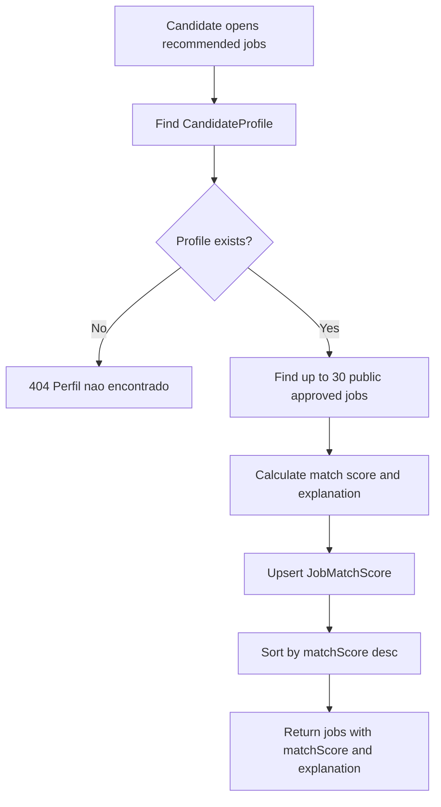
```mermaid
flowchart TD
  candidate["Candidate opens recommended jobs"] --> getProfile["Find CandidateProfile"]
  getProfile --> profileExists{"Profile exists?"}
  profileExists -- "No" --> missingProfile["404 Perfil nao encontrado"]
  profileExists -- "Yes" --> getJobs["Find up to 30 public approved jobs"]
  getJobs --> calculate["Calculate match score and explanation"]
  calculate --> saveScore["Upsert JobMatchScore"]
  saveScore --> sortScores["Sort by matchScore desc"]
  sortScores --> returnRecommendations["Return jobs with matchScore and explanation"]
```

Current state:
- Recommendations depend on a saved candidate profile.
- Matching is calculated at request time and stored.

## 9. Save Job

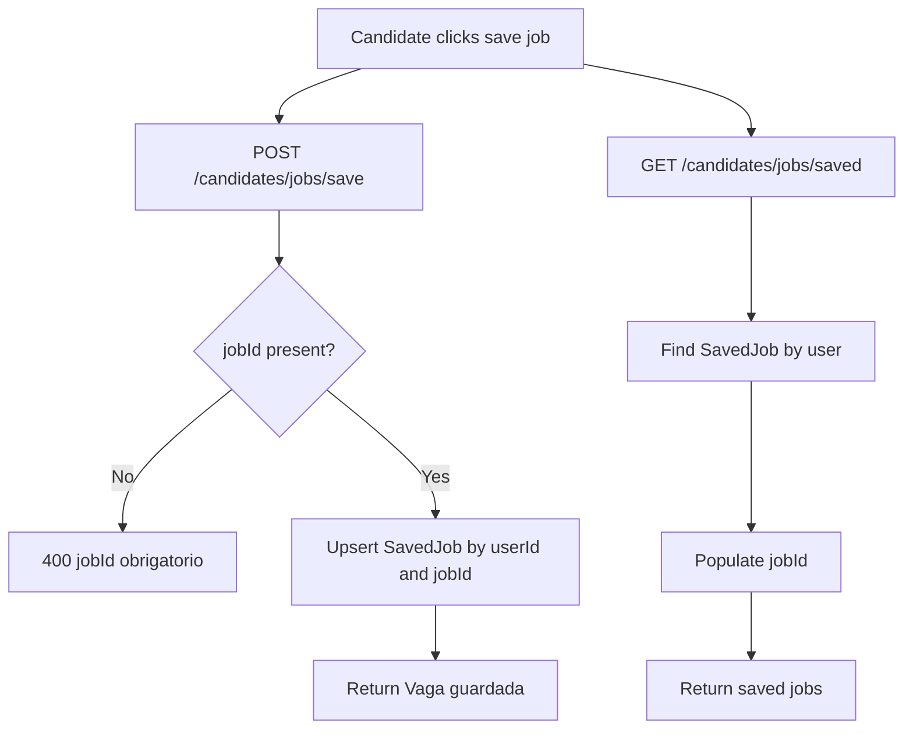
```mermaid
flowchart TD
  candidate["Candidate clicks save job"] --> postSave["POST /candidates/jobs/save"]
  postSave --> jobId{"jobId present?"}
  jobId -- "No" --> error["400 jobId obrigatorio"]
  jobId -- "Yes" --> upsertSaved["Upsert SavedJob by userId and jobId"]
  upsertSaved --> success["Return Vaga guardada"]
  candidate --> getSaved["GET /candidates/jobs/saved"]
  getSaved --> findSaved["Find SavedJob by user"]
  findSaved --> populateJob["Populate jobId"]
  populateJob --> returnSaved["Return saved jobs"]
```

Current state:
- The save endpoint does not currently verify that the saved job is public approved before saving.

## 10. Candidate Applies To Job

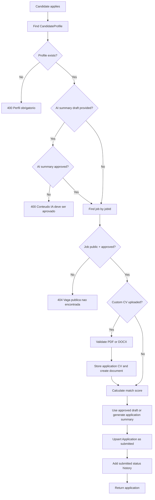
```mermaid
flowchart TD
  candidate["Candidate applies"] --> profile["Find CandidateProfile"]
  profile --> hasProfile{"Profile exists?"}
  hasProfile -- "No" --> profileError["400 Perfil obrigatorio"]
  hasProfile -- "Yes" --> aiDraft{"AI summary draft provided?"}
  aiDraft -- "Yes" --> aiApproved{"AI summary approved?"}
  aiApproved -- "No" --> aiError["400 Conteudo IA deve ser aprovado"]
  aiDraft -- "No" --> findJob["Find job by jobId"]
  aiApproved -- "Yes" --> findJob
  findJob --> publicApproved{"Job public + approved?"}
  publicApproved -- "No" --> jobError["404 Vaga publica nao encontrada"]
  publicApproved -- "Yes" --> customCv{"Custom CV uploaded?"}
  customCv -- "Yes" --> validateCv["Validate PDF or DOCX"]
  validateCv --> storeCv["Store application CV and create document"]
  customCv -- "No" --> match["Calculate match score"]
  storeCv --> match
  match --> summary["Use approved draft or generate application summary"]
  summary --> upsertApplication["Upsert Application as submitted"]
  upsertApplication --> history["Add submitted status history"]
  history --> returnApplication["Return application"]
```

Current state:
- Applications require a candidate profile.
- AI-generated application content must be approved if the candidate supplies an AI draft.
- Duplicate applications are upserted by candidate and job.

## 11. Admin Job Moderation (Real-Time Friendly)

```mermaid
flowchart TD
  moderator["Admin/Moderator"] --> click["Clica Aprovar/Rejeitar/Arquivar"]
  click --> optimistic["UI atualiza badge localmente"]
  optimistic --> patch["PATCH /admin/jobs/:id/moderate"]
  patch --> ok{"200 OK?"}
  ok -- "Sim" --> toast["Toast de sucesso"]
  ok -- "Não" --> revert["UI reverte estado anterior + erro"]
  toast --> polling["Polling periódico atualiza concorrência"]
```

Current state:
- O backend devolve o objeto `job` atualizado.
- A UI de moderação aplica atualização otimista e rollback em erro.
- Há refresh periódico para refletir alterações concorrentes entre admins.

## 12. Verificação de Empresas Com Templates

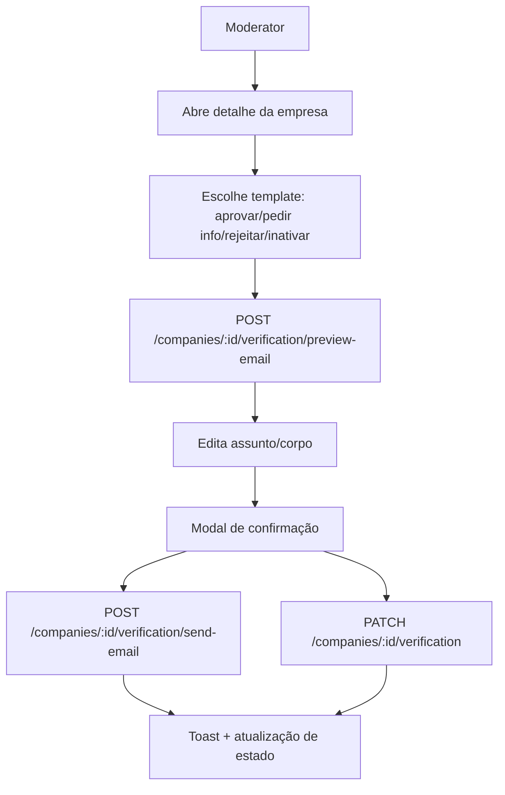
```mermaid
flowchart TD
  moderator["Moderator"] --> openDetail["Abre detalhe da empresa"]
  openDetail --> chooseTemplate["Escolhe template: aprovar/pedir info/rejeitar/inativar"]
  chooseTemplate --> preview["POST /companies/:id/verification/preview-email"]
  preview --> editBody["Edita assunto/corpo"]
  editBody --> confirm["Modal de confirmação"]
  confirm --> sendEmail["POST /companies/:id/verification/send-email"]
  confirm --> setStatus["PATCH /companies/:id/verification"]
  sendEmail --> done["Toast + atualização de estado"]
  setStatus --> done
```

Current state:
- Templates padrão configurados em `server/config/companyVerificationEmailTemplates.js`.
- Placeholders (`{{contactPerson}}`, `{{companyName}}`, etc.) são resolvidos antes de enviar.
- Estados suportados: `active`, `pending_verification`, `rejected`, `inactive`.

## 13. Scraped Jobs: Curadoria E Conversão

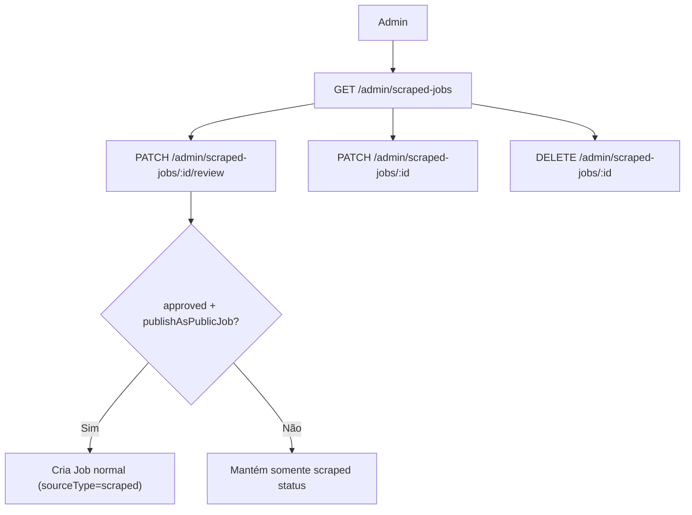
```mermaid
flowchart TD
  admin["Admin"] --> list["GET /admin/scraped-jobs"]
  list --> review["PATCH /admin/scraped-jobs/:id/review"]
  review --> approve{"approved + publishAsPublicJob?"}
  approve -- "Sim" --> createJob["Cria Job normal (sourceType=scraped)"]
  approve -- "Não" --> keep["Mantém somente scraped status"]
  list --> edit["PATCH /admin/scraped-jobs/:id"]
  list --> remove["DELETE /admin/scraped-jobs/:id"]
```

Current state:
- Empty-state explícito no portal admin: “Nenhum anúncio de vaga raspado disponível.”
- A aprovação pode converter o registo scraped numa vaga normal.

## 14. Auditoria Operacional

Current state:
- Ações críticas são registadas via `logAudit` e `logAdminAction`.
- Página de auditoria suporta filtros por ação, tipo de recurso, userId e intervalo de datas.
- Exportação CSV disponível por `GET /admin/audit-logs/export.csv`.

## 11. Application Status Management

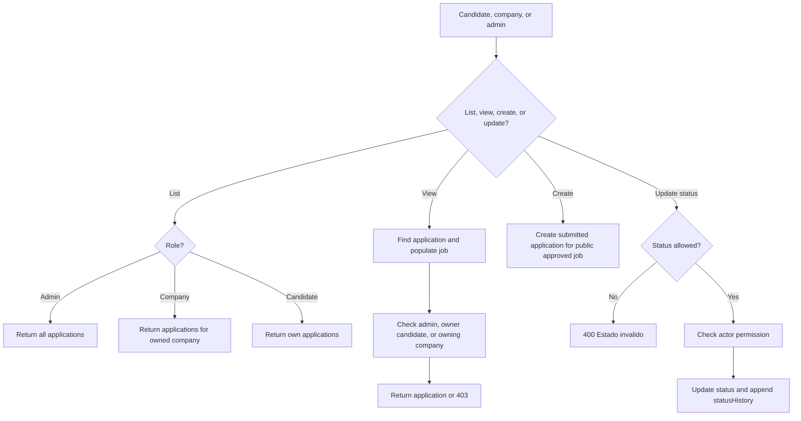
```mermaid
flowchart TD
  actor["Candidate, company, or admin"] --> listOrUpdate{"List, view, create, or update?"}
  listOrUpdate -- "List" --> roleList{"Role?"}
  roleList -- "Admin" --> allApps["Return all applications"]
  roleList -- "Company" --> companyApps["Return applications for owned company"]
  roleList -- "Candidate" --> candidateApps["Return own applications"]
  listOrUpdate -- "View" --> findApp["Find application and populate job"]
  findApp --> permissionCheck["Check admin, owner candidate, or owning company"]
  permissionCheck --> returnOr403["Return application or 403"]
  listOrUpdate -- "Create" --> createApp["Create submitted application for public approved job"]
  listOrUpdate -- "Update status" --> allowedStatus{"Status allowed?"}
  allowedStatus -- "No" --> invalidStatus["400 Estado invalido"]
  allowedStatus -- "Yes" --> statusPermission["Check actor permission"]
  statusPermission --> appendHistory["Update status and append statusHistory"]
```

Current state:
- Statuses include draft, submitted, viewed, shortlisted, interview, rejected, hired, withdrawn.
- Candidates can update status on their own application if allowed by route/middleware.

## 13. Employer Onboarding Tutorial (Multi-step + Resume)

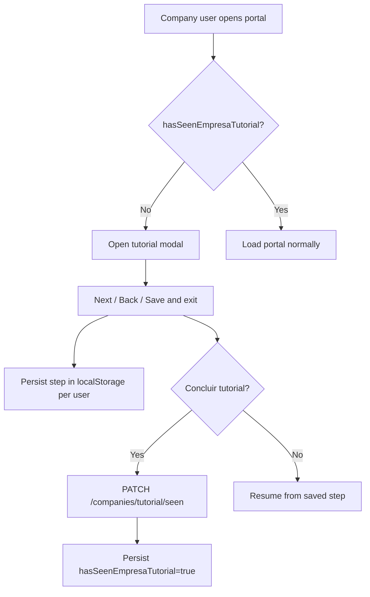
```mermaid
flowchart TD
  companyUser["Company user opens portal"] --> seen{"hasSeenEmpresaTutorial?"}
  seen -- "No" --> openTutorial["Open tutorial modal"]
  seen -- "Yes" --> normalPortal["Load portal normally"]
  openTutorial --> stepNav["Next / Back / Save and exit"]
  stepNav --> saveProgress["Persist step in localStorage per user"]
  stepNav --> complete{"Concluir tutorial?"}
  complete -- "Yes" --> apiSeen["PATCH /companies/tutorial/seen"]
  apiSeen --> updateUser["Persist hasSeenEmpresaTutorial=true"]
  complete -- "No" --> resumeLater["Resume from saved step"]
```

Current state:
- Tutorial opens automatically for first-time company users and can be relaunched from `/Portal/Empresa/Definicoes`.
- Progress resumes from the last saved step.

## 14. Company Verification Email + Deletion Approval Workflow

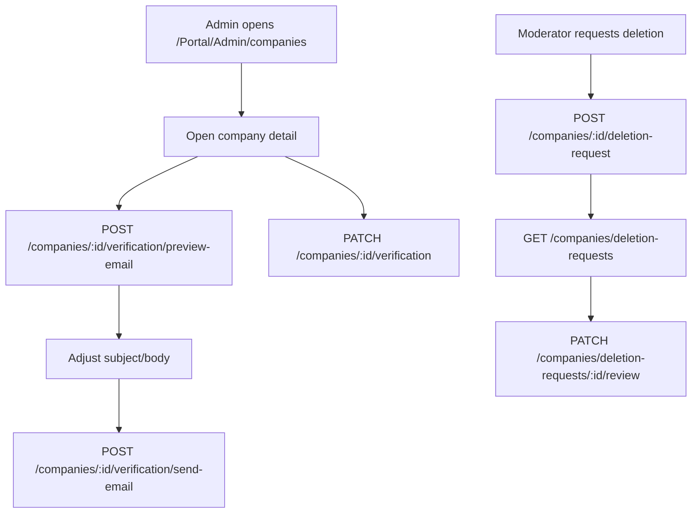
```mermaid
flowchart TD
  admin["Admin opens /Portal/Admin/companies"] --> selectCompany["Open company detail"]
  selectCompany --> previewEmail["POST /companies/:id/verification/preview-email"]
  previewEmail --> editDraft["Adjust subject/body"]
  editDraft --> sendEmail["POST /companies/:id/verification/send-email"]
  selectCompany --> statusDecision["PATCH /companies/:id/verification"]
  moderator["Moderator requests deletion"] --> deletionReq["POST /companies/:id/deletion-request"]
  deletionReq --> superAdminQueue["GET /companies/deletion-requests"]
  superAdminQueue --> reviewReq["PATCH /companies/deletion-requests/:id/review"]
```

Current state:
- Moderators can request deletion, but only super-admin can approve/reject pending deletion requests.
- Verification emails support templates: approval, more_info, rejected, meeting.

## 15. Internal Company Messaging via Notifications

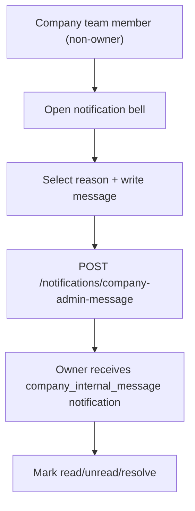
```mermaid
flowchart TD
  teamMember["Company team member (non-owner)"] --> openBell["Open notification bell"]
  openBell --> pickReason["Select reason + write message"]
  pickReason --> send["POST /notifications/company-admin-message"]
  send --> ownerNotif["Owner receives company_internal_message notification"]
  ownerNotif --> manage["Mark read/unread/resolve"]
```

Current state:
- Reason values are whitelist-based and localized in Portuguese.

## 12. Company Registration And Job Management

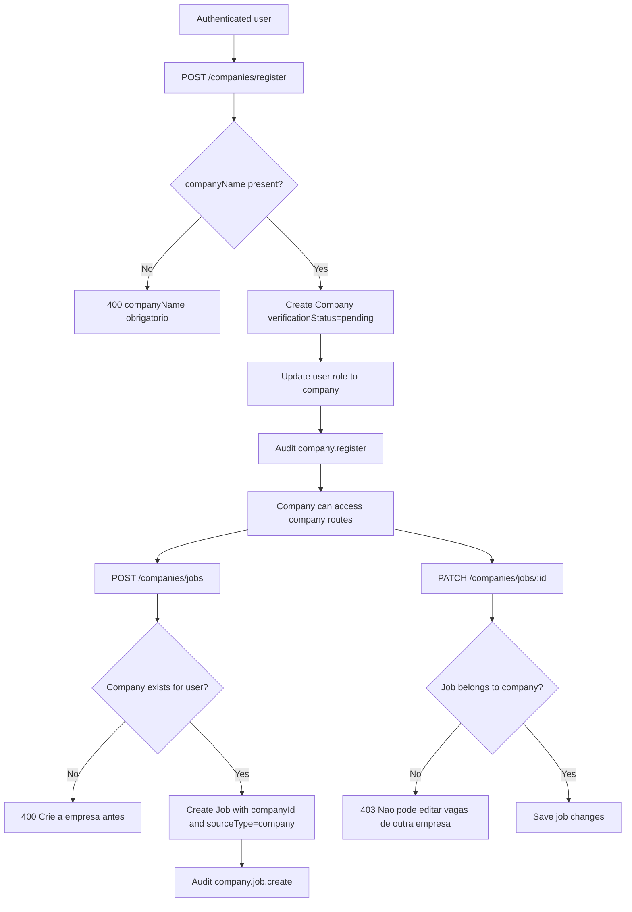
```mermaid
flowchart TD
  user["Authenticated user"] --> registerCompany["POST /companies/register"]
  registerCompany --> companyName{"companyName present?"}
  companyName -- "No" --> error["400 companyName obrigatorio"]
  companyName -- "Yes" --> createCompany["Create Company verificationStatus=pending"]
  createCompany --> setRole["Update user role to company"]
  setRole --> auditCompany["Audit company.register"]
  auditCompany --> companyPortal["Company can access company routes"]
  companyPortal --> createJob["POST /companies/jobs"]
  createJob --> hasCompany{"Company exists for user?"}
  hasCompany -- "No" --> noCompany["400 Crie a empresa antes"]
  hasCompany -- "Yes" --> saveJob["Create Job with companyId and sourceType=company"]
  saveJob --> auditJob["Audit company.job.create"]
  companyPortal --> editJob["PATCH /companies/jobs/:id"]
  editJob --> ownsJob{"Job belongs to company?"}
  ownsJob -- "No" --> forbidden["403 Nao pode editar vagas de outra empresa"]
  ownsJob -- "Yes" --> updateJob["Save job changes"]
```

Current state:
- Company verification starts as pending.
- Job creation does not automatically force pending moderation in this controller; it trusts payload fields unless schema defaults handle them.

## 13. Company Applications

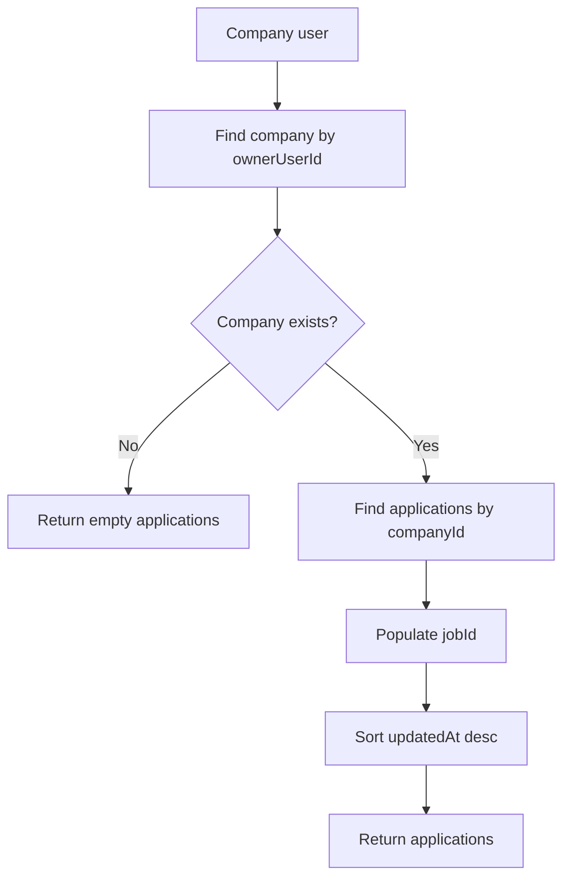
```mermaid
flowchart TD
  companyUser["Company user"] --> getCompany["Find company by ownerUserId"]
  getCompany --> companyExists{"Company exists?"}
  companyExists -- "No" --> empty["Return empty applications"]
  companyExists -- "Yes" --> findApps["Find applications by companyId"]
  findApps --> populateJob["Populate jobId"]
  populateJob --> sortUpdated["Sort updatedAt desc"]
  sortUpdated --> returnApps["Return applications"]
```

Current state:
- Companies only see applications tied to their company record.

## 14. Admin Overview, Users, Jobs, Companies

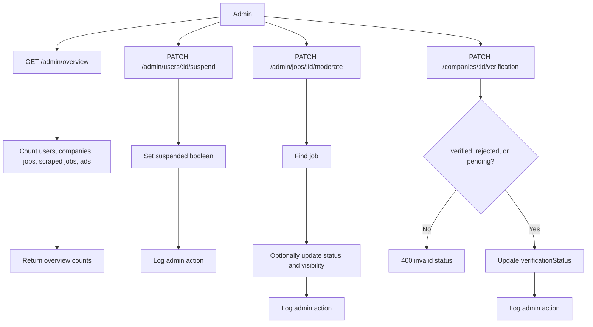
```mermaid
flowchart TD
  admin["Admin"] --> overview["GET /admin/overview"]
  overview --> counts["Count users, companies, jobs, scraped jobs, ads"]
  counts --> dashboard["Return overview counts"]
  admin --> suspend["PATCH /admin/users/:id/suspend"]
  suspend --> updateUser["Set suspended boolean"]
  updateUser --> logSuspend["Log admin action"]
  admin --> moderate["PATCH /admin/jobs/:id/moderate"]
  moderate --> findJob["Find job"]
  findJob --> applyStatus["Optionally update status and visibility"]
  applyStatus --> logModeration["Log admin action"]
  admin --> verifyCompany["PATCH /companies/:id/verification"]
  verifyCompany --> validStatus{"verified, rejected, or pending?"}
  validStatus -- "No" --> error["400 invalid status"]
  validStatus -- "Yes" --> updateCompany["Update verificationStatus"]
  updateCompany --> logVerify["Log admin action"]
```

Current state:
- Admin can moderate visibility and approval status.
- Public listings only expose jobs that become public and approved.

## 15. Scraped Jobs Review

```mermaid
flowchart TD
  admin["Admin or scraping intake"] --> createScraped["POST /admin/scraped-jobs"]
  createScraped --> fingerprint["Create fingerprint from title, company, location"]
  fingerprint --> duplicate{"Existing fingerprint?"}
  duplicate -- "Yes" --> markDuplicate["Set duplicateOf"]
  duplicate -- "No" --> noDuplicate["duplicateOf=null"]
  markDuplicate --> pending["Create ScrapedJob status=pending"]
  noDuplicate --> pending
  pending --> review["PATCH /admin/scraped-jobs/:id/review"]
  review --> merge{"mergeIntoScrapedJobId provided?"}
  merge -- "Yes" --> merged["Set status=merged and duplicateOf target"]
  merge -- "No" --> setStatus["Set review status and note"]
  setStatus --> publish{"status approved and publishAsPublicJob=true?"}
  publish -- "No" --> logReview["Log scraped.review"]
  publish -- "Yes" --> createPublicJob["Create Job public + approved sourceType=scraped"]
  createPublicJob --> logReview
```

Current state:
- Scraped jobs enter pending by default.
- Publishing to public jobs only happens during explicit review with `publishAsPublicJob=true`.

## 16. Ads

```mermaid
flowchart TD
  admin["Admin"] --> createAd["POST /admin/ads"]
  createAd --> saveCampaign["Create AdCampaign"]
  saveCampaign --> logAd["Log ads.create"]
  visitor["Visitor or frontend"] --> listAds["GET /public/ads?placement=..."]
  listAds --> activeWindow["Filter active=true and date window"]
  activeWindow --> returnAds["Return ads"]
  visitor --> impression["POST /public/ads/:id/impression"]
  impression --> incImpressions["Increment impressions"]
  visitor --> click["POST /public/ads/:id/click"]
  click --> incClicks["Increment clicks"]
  incClicks --> returnLink["Return link"]
```

Current state:
- Ads are managed manually.
- There is tracking for impressions and clicks.
- There is no payment or subscription workflow.

## 17. Search Indexing

```mermaid
flowchart TD
  operator["Operator runs npm run reindex:jobs"] --> envCheck["Check DB and MeiliSearch config"]
  envCheck --> configured{"Configured?"}
  configured -- "No" --> skip["Skip indexing"]
  configured -- "Yes" --> fetchJobs["Fetch public approved jobs"]
  fetchJobs --> mapDocs["Map jobs to search documents"]
  mapDocs --> configureIndex["Configure filterable and sortable attributes"]
  configureIndex --> addDocs["Add documents to public_jobs index"]
  addDocs --> searchable["GET /jobs?useSearch=true can query index"]
```

Current state:
- MeiliSearch is optional.
- Index should include only public approved jobs.

## 18. SEO And Compliance Pages

```mermaid
flowchart TD
  crawler["Crawler or browser"] --> sitemap["/sitemap.xml via src/app/sitemap.ts"]
  sitemap --> publicRoutes["Static public routes"]
  crawler --> publicSitemapJobs["GET /public/sitemap-jobs"]
  publicSitemapJobs --> approvedJobs["Return public approved job IDs"]
  browser["Browser"] --> legalPages["Legal pages"]
  legalPages --> privacy["/privacidade"]
  legalPages --> terms["/termos"]
  legalPages --> retention["/politica-retencao"]
  legalPages --> employerTerms["/termos-empregador"]
  browser --> cookies["Cookie consent component"]
```

Current state:
- Legal pages and cookie consent exist.
- Dynamic job sitemap support exists at API level.

## Current Implementation Gaps To Compare Against Vision

```mermaid
flowchart TD
  vision["Product vision"] --> compare["Compare with current build"]
  compare --> staticFrontend["Some public frontend pages use static local data"]
  compare --> apiReady["Backend APIs exist for many workflows"]
  compare --> filtersVisual["Public listing filters are visual only"]
  compare --> apiPaginationMissing["GET /jobs has filters but no DB pagination"]
  compare --> portalPlaceholders["Several portal pages are placeholders"]
  compare --> aiFallback["AI adapter defaults to fallback parser"]
  compare --> localStorage["Storage service defaults to local adapter"]
  compare --> searchOptional["MeiliSearch requires external configuration"]
  compare --> noPayments["Ads have no payment workflow by design"]
```

Use this section as a checklist when defining the envisioned version:
- Should public jobs come from the backend API instead of static arrays?
- Should filters and pagination be API-driven?
- Should company-created jobs always begin as pending moderation?
- Should candidate portal pages become fully connected to the backend?
- Should recommendations run live, be cached, or be generated asynchronously?
- Should applications have richer company-side workflow stages and notifications?
- Should scraped-job approval require selecting or creating a verified company?
- Should ads remain manual, or should they gain billing later?
